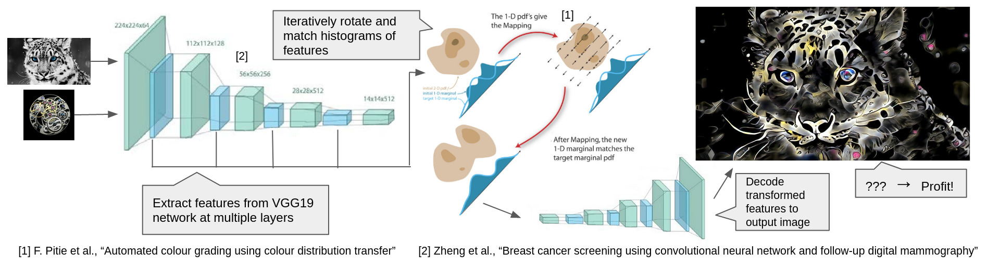

# Optex
An implementation of [Optimal Textures: Fast and Robust Texture Synthesis and Style Transfer through Optimal Transport](https://arxiv.org/abs/2010.14702) for TU Delft CS4240.



You can find a more in-depth summary of the implementation [in this blog post](https://wavefunk.xyz/optex).

## Installation
```bash
git clone https://github.com/JCBrouwer/OptimalTextures
cd OptimalTextures
pip install -r requirements.txt
python optex.py -h
```

## Texture synthesis

Generate a texture based on an example:
```bash
python optex.py --style style/graffiti.jpg --size 512
```

## Style transfer

Supply two images and synthesize one in the style of the other.
```bash
python optex.py --style style/lava-small.jpg --content content/rocket.jpg --content_strength 0.2
```

## Texture mixing

Blend two textures together.

```bash
python optex.py --style style/zebra.jpg style/pattern-small.jpg --mixing_alpha 0.5  
```

## Color transfer

Perform style transfer but keep the original colors of the content.

```bash
python optex.py --style style/green-paint-large.jpg --content content/city.jpg --style_scale 0.5 --content_strength 0.2 --color_transfer opt --size 1024
```
