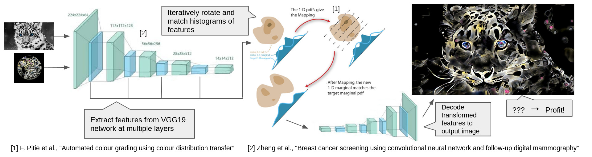

# Optex
An implementation of [Optimal Textures: Fast and Robust Texture Synthesis and Style Transfer through Optimal Transport](https://arxiv.org/abs/2010.14702) for TU Delft CS4240.



You can find a more in-depth summary of the implementation [in this blog post](https://wavefunk.xyz/optex).

## Installation
```bash
git clone https://github.com/JCBrouwer/OptimalTextures
cd OptimalTextures
pip install -r requirements.txt
python optex.py -h
```

## Texture synthesis

Generate a texture based on an example:
```bash
python optex.py --style style/graffiti.jpg --size 512
```

## Style transfer

Supply two images and synthesize one in the style of the other.
```bash
python optex.py --style style/lava-small.jpg --content content/rocket.jpg --content_strength 0.2
```

## Texture mixing

Blend two textures together.

```bash
python optex.py --style style/zebra.jpg style/pattern-small.jpg --mixing_alpha 0.5  
```

## Color transfer

Perform style transfer but keep the original colors of the content.

```bash
python optex.py --style style/green-paint-large.jpg --content content/city.jpg --style_scale 0.5 --content_strength 0.2 --color_transfer opt --size 1024
```

## Histogram matching modes

`--hist_mode` picks how the (rotated) features are matched to the style's.

| mode | what it matches | notes |
| --- | --- | --- |
| `sort` (default) | every channel's full histogram, exactly | the 1D optimal transport map: the k-th smallest value becomes the style's k-th smallest. One batched sort for all channels. |
| `cdf` | every channel's full histogram, binned | 256 bins per channel, all channels counted in one `scatter_add`. Linear in the number of pixels, so it overtakes `sort` on large images on CPU. |
| `chol`, `pca`, `sym` | mean and covariance only | a single linear map. No rotation changes a covariance, so these are exact after one step and skip the iterations entirely when there is no content image. Fastest, a little less faithful. |

Features are projected onto the principal components that explain `--pca_variance` (default 0.99) of the style's variance before matching. Lower values are faster and lose color and fine detail, `--no_pca` keeps everything.

## Refinement

The decoders limit how sharp the result can get. `--refine 100` follows up with that many steps of gradient descent on a [sliced Wasserstein loss](https://arxiv.org/abs/2006.07229) through the encoder alone, starting from the decoded image. This is much slower per step than the feed-forward part, so it is off by default.

```bash
python optex.py --style style/graffiti.jpg --size 512 --refine 100
```

## Measuring

`evaluate.py` scores outputs by the sliced Wasserstein distance between their VGG features and the style's (lower is better), and `benchmark.py` times and scores each mode on your device.

```bash
python evaluate.py --style style/graffiti.jpg --size 512 output/graffiti_*.png
python benchmark.py --sizes 256 512 1024 --modes sort cdf chol
```
