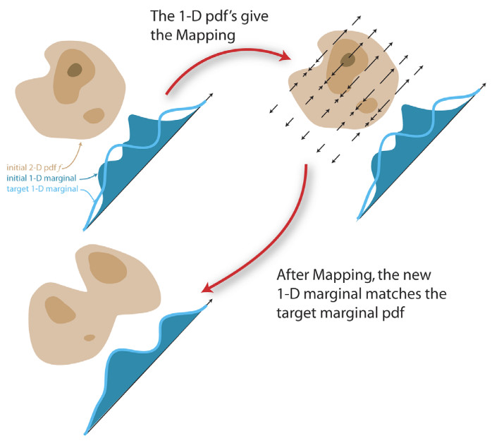
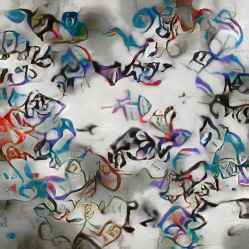
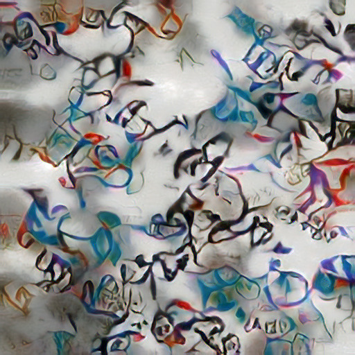

# Replicating "Optimal Textures: Fast and Robust Texture Synthesis and Style Transfer through Optimal Transport"

Hans Brouwer & Jim Kok

In this post we give an overview of our replication of the paper [Optimal Textures: Fast and Robust Texture Synthesis and Style Transfer through Optimal Transport](https://arxiv.org/abs/2010.14702) for the [Delft University of Technology Deep Learning course CS4240](https://cs4240tud.github.io/). Our implementation in PyTorch can be found [here](https://github.com/JCBrouwer/OptimalTextures).

## Overview
Optimal Textures presents a new approach for texture synthesis and several other related tasks. The algorithm can directly optimize the histograms of intermediate features of an image recognition model (VGG-19) to match the statistics of a target image. This avoids the costly backpropagation which is required by other approaches which try to instead match 2nd order statistics like the Gram matrix (the correlations between intermediate features). Compared to other algorithms which seek to speed up texture synthesis, Optimal Textures achieves a better quality in less time.

The approach builds on a VGG-19 autoencoder which is trained to invert internal features of a pretrained VGG-19 network back to an image. This was originally introduced by Li et al. in [Universal Style Transfer via Feature Transforms](https://arxiv.org/abs/1705.08086). This autoencoder allows one to encode an image to feature space, perform a direct optimization on these features, and then decode back to an image.

The core algorithm introduced by Optimal Textures consists of 4 steps:
1. Encode a target and style image to the intermediate features of an image recognition network
2. Apply a random rotation to the features of both images
3. Match the histograms of the rotated feature tensors
4. Undo the rotation and decode the features back to image space

Steps 2 and 3 are applied iteratively so that the histograms of the two images match from a large selection of random "viewing angles". This process is also applied at 5 different layers within the VGG-19 network (relu1_1, relu2_1, relu3_1, etc.). This ensures that the statistics of the output image match the style image in terms of the entire hierarchy of image features that VGG-19 has learned to be important for distinguishing images. A single histogram matching step applied in 2D is shown in the figure below (in reality this process is being applied in 64 - 512 dimensions, depending on the layer in VGG).

 

Matching the histograms of features along a single direction in 2D space.

Source: <a href="https://citeseerx.ist.psu.edu/viewdoc/download?doi=10.1.1.458.7694&rep=rep1&type=pdf">F. Pitie et al., "Automated Colour Grading Using Colour Distribution Transfer"</a>

### Speeding things up
This relatively simple algorithm can be augmented by a couple techniques that improve the speed and quality of results.

The first technique is to project the matched features to a smaller subspace and perform the optimization there. The chosen subspace is the one spanned by the first principal components that capture 90% of the total variance in the style features. This reduces the dimension of the feature tensors while retaining the majority of their descriptive capacity.

The second technique is to synthesize images starting from a small resolution (256 pixels) and progressively upscaling during optimization to the desired size. Once again, this reduces the size of the feature tensors (this time along the spatial axes) which improves speed. Another benefit is that longer-range relations in the example image are captured as the receptive field of VGG-19's convolutions is larger for the smaller starting images.

### Extensions
The paper further shows how the basic algorithm can be used for multiple tasks similar to texture synthesis: style transfer, color transfer, texture mixing, and mask-guided synthesis.

#### Style transfer
To achieve style transfer, a content image's features are added into the mix. The features of the deepest three layers of the output image are interpolated toward the features of the content image. Notably, the content image's features must be centered around the mean of the style image's features to ensure the two are not tugging the output image back and forth between distant parts of feature space.

#### Color transfer
The naive approach to color transfer would be to directly apply the optimal transport algorithm to the images themselves rather to their features. However, the paper introduces an extension of this which preserves the colors of the content image a little better. The basis for this technique is luminance transfer, which takes the hue and saturation channels of the content image (in HSL space) and substitutes them into the output of the optimal transport style transfer. The drawback of luminance transfer is that the finer colored details in the style are no longer present, instead directly taking the color of the underlying content. To remedy this, a few final iterations of the optimal transport algorithm are applied with the luminance transfered output as target. This gives a happy medium between the content focused color transfer of the luminance approach and the style focused color transfer of the naive optimal transfer approach.

#### Texture mixing
Another task which the paper introduces is t

#### Mask-guided synthesis

## Replication

Now we will discuss our implementation of the above concepts. We've managed to replicate all of the above findings except for the mask-guided texture synthesis (partially due to time constraints, partially due to it not being amenable to our program's structure).

### Core algorithm

### Histogram matching

### PCA
By means of PCA the algorithm selects the channels that contribute to 90% of the variance of each VGG-19 layer. To simplify things, the variance can be seen as the variation of pixel intensities of a certain channel. This means that if the variance of a channel is high, the pixel values of this channel are diversified. Therefore, they are also more likely to contain relevant information about the representation of the image. Then the histogram matching is performed on these reduced number of channels. This process significantly improves the speed of the algorithm. In image below it can be seen the there are minor differences PCA and no PCA.
 

 

No PCA vs PCA.

### Multi-resolution synthesis

### Style transfer

### Color transfer
For the first step of this part it is required to apply normal style transfer to an input image (and a style image of course). The style transfer is applied on the input image which is represented by 3 channels, namely R(red), G(reen) and B(lue). For luminance style transfer the input image and output image are converted from RGB to H(ue)S(aturation)L(ightening). Then the H and S component from the imput image are combined with the L component of the output image. Our result is displayed in image ... As can be seen from this image, the effect of style transfer is diminished and more colors of the input image are maintained. Whereas, the effect of the style remains visible.

### Texture mixing

<!-- 
## Related Work
Since the seminal work by Gatys et al., [A Neural Algorithm of Artistic Style](https://arxiv.org/abs/1508.06576), many  -->
