# Replicating "Optimal Textures: Fast and Robust Texture Synthesis and Style Transfer through Optimal Transport"

Hans Brouwer & Jim Kok

In this post we give an overview of our replication of the paper [Optimal Textures: Fast and Robust Texture Synthesis and Style Transfer through Optimal Transport](https://arxiv.org/abs/2010.14702) for the [Delft University of Technology Deep Learning course CS4240](https://cs4240tud.github.io/). Our implementation in PyTorch can be found [here](https://github.com/JCBrouwer/OptimalTextures).

## Overview
Optimal Textures presents a new approach for texture synthesis and several other related tasks. The algorithm can directly optimize the histograms of intermediate features of an image recognition model (VGG-19) to match the statistics of a target image. This avoids the costly backpropagation which is required by other approaches which try to instead match 2nd order statistics like the Gram matrix (the correlations between intermediate features). Compared to other algorithms which seek to speed up texture synthesis, Optimal Textures achieves a better quality in less time.

The approach builds on a VGG-19 autoencoder which is trained to invert internal features of a pretrained VGG-19 network back to an image. This was originally introduced by Li et al. in [Universal Style Transfer via Feature Transforms](https://arxiv.org/abs/1705.08086). This autoencoder allows one to encode an image to feature space, perform a direct optimization on these features, and then decode back to an image.

The core algorithm introduced by Optimal Textures consists of 4 steps:
1. Encode a target and style image to the intermediate features of an image recognition network
2. Apply a random rotation to the features of both images
3. Match the histograms of the rotated feature tensors
4. Undo the rotation and decode the features back to image space

Steps 2 and 3 are applied iteratively so that the histograms of the two images match from a large selection of random "viewing angles". This process is also applied at 5 different layers within the VGG-19 network (relu1_1, relu2_1, relu3_1, etc.). This ensures that the statistics of the output image match the style image in terms of the entire hierarchy of image features that VGG-19 has learned to be important for distinguishing images. A single histogram matching step applied in 2D is shown in the figure below (in reality this process is being applied in 64 - 512 dimensions, depending on the layer in VGG).

 

Matching the histograms of features along a single direction in 2D space.

Source: <a href="https://citeseerx.ist.psu.edu/viewdoc/download?doi=10.1.1.458.7694&rep=rep1&type=pdf">F. Pitie et al., "Automated Colour Grading Using Colour Distribution Transfer"</a>

### Speeding things up
This relatively simple algorithm can be augmented by a couple techniques that improve the speed and quality of results.

The first technique is to project the matched features to a smaller subspace and perform the optimization there. The chosen subspace is the one spanned by the first principal components that capture 90% of the total variance in the style features. This reduces the dimension of the feature tensors while retaining the majority of their descriptive capacity.

The second technique is to synthesize images starting from a small resolution (256 pixels) and progressively upscaling during optimization to the desired size. Once again, this reduces the size of the feature tensors (this time along the spatial axes) which improves speed. Another benefit is that longer-range relations in the example image are captured as the receptive field of VGG-19's convolutions is larger for the smaller starting images.

### Extensions
The paper further shows how the basic algorithm can be used for multiple tasks similar to texture synthesis: style transfer, color transfer, texture mixing, and mask-guided synthesis.

#### Style transfer
To achieve style transfer, a content image's features are added into the mix. The features of the deepest three layers of the output image are interpolated toward the features of the content image. Notably, the content image's features must be centered around the mean of the style image's features to ensure the two are not tugging the output image back and forth between distant parts of feature space.

#### Color transfer
The naive approach to color transfer would be to directly apply the optimal transport algorithm to the images themselves rather to their features. However, the paper introduces an extension of this which preserves the colors of the content image a little better. The basis for this technique is luminance transfer, which takes the hue and saturation channels of the content image (in HSL space) and substitutes them into the output of the optimal transport style transfer. The drawback of luminance transfer is that the finer colored details in the style are no longer present, instead directly taking the color of the underlying content. To remedy this, a few final iterations of the optimal transport algorithm are applied with the luminance transfered output as target. This gives a happy medium between the content focused color transfer of the luminance approach and the style focused color transfer of the naive optimal transfer approach.

#### Texture mixing
Another task which the paper applies the new algorithm to is texture mixing. Here, two styles should be blended into a texture which retains aspects of both. To achieve this, the target feature tensors are edited to have aspects of both styles. First the optimal transport mapping from the first style to the second and from the second style to the first is calculated. This is as simple as matching the histogram of each style with the histogram of the other as target. This gives 4 feature tensors that are combined to form the new target.

A blending value between 0 and 1 is introduced to control the weight of each style in the mixture. First each style is blended with its histogram matched version according to blending value. When the blend value is zero, the first style is unchanged, while the second style is 100% the version matched to the histogram of the first style. When the blend value is 0.75, the first style is 1/4 original, 3/4 histogram matched and the second style vice versa.

Next a binary mixing mask is introduced with the percentage of ones corresponding to the blending value. This mask is used to mix between the two interpolated style features. When the blend value is low, the majority of pixels in the feature tensor will be from the first style's feature tensor, when it's high the majority comes from the second style.

This is repeated at each depth in the VGG autoencoder. These doubly blended feature targets are then directly used in the rest of the optimization, which proceeds as usual.

#### Mask-guided synthesis
The final application of optimal textures is mask-guided synthesis. In this task, a style image, style mask, and content mask are used as input. The parts of the style image corresponding to each label in the style mask are then synthesized in the places where each label is present in the content mask.

To achieve this the histogram of the style features is separated into a histogram per label in the mask. Then the output images histogram targets in the optimization are weighted based on the labels in the content mask. Pixels which lie along borders between 2 class labels are optimized with an interpolation between the nearby labels based on the distance to pixels of that class. This ensures that regions along the borders interpolate smoothly following the statistical patterns present in the style image.

## Replication

Now we will discuss our implementation of the above concepts. We've managed to replicate all of the above findings except for the mask-guided texture synthesis (partially due to time constraints, partially due to it not being amenable to our program's structure).

### Core algorithm
The core algorithm consists of only a few lines. We build upon one of the [official repositories for Universal Style Transfer via Feature Trasforms](https://github.com/pietrocarbo/deep-transfer). This contains the code and pre-trained checkpoints for the VGG autoencoder. This gives one PyTorch nn.Sequential module that can encode an image to a given layer (e.g. relu3_1) and a module that decodes those layer features back to an image.

One thing to note is that we follow pseudo-code from the paper which seems to invert the features all the way back to an image between each optimization at a given depth. It is also possible to step up only a single layer (e.g. from relu5_1 to relu4_1). This would improve memory usage significantly as a much smaller portion of the VGG network would be needed in memory. Right now memory spikes for the encode/decode operations are the limiting factor for the size which can be generated. Next to reducing memory this would also reduce FLOPs needed per encode/decode and so reduce execution time.

Once features are encoded, we need to rotate before matching their histograms. To this end, we draw random rotation matrices from the [Special Orthogonal Group](https://en.wikipedia.org/wiki/Orthogonal_group). These are matrices that can perform any N-dimensional rotation and have the handy property that their transpose is also their inverse. We've translated to PyTorch [SciPy's function](https://docs.scipy.org/doc/scipy/reference/generated/scipy.stats.special_ortho_group.html#scipy.stats.special_ortho_group) that can draw uniformly from the N-dimensional special orthogonal group (giving us uniformly distributed random rotations). For each iteration, we draw a random matrix, rotate by multiplying both the style and output features by this matrix, perform histogram matching, and then rotate back by multiplying with the transpose of the rotation matrix.

### Histogram matching
Matching N-channel histograms is the true heart of Optimal Textures. Therefore it is important that this part of the algorithm is fast. The classic way of matching histograms is to convert both histograms to CDFs and then use the source CDF as a look up table to remap each color intensity in the target CDF.

<figure style="text-align: center; text-color: gray; font-size: 11px">

<figcaption style="text-align: center; text-color: gray; font-size: 11px">Intensity value x1 in the image gets mapped to intensity x2.

Source: <a href="https://en.wikipedia.org/wiki/Histogram_matching">Wikipedia article on histogram matching</a></figcaption>
</figure>

However, we found this method difficult to implement efficiently. First of all, the PyTorch function for calculating histograms, `torch.histc`, does not support batched calculation. Trying to use the ([experimental as of time of writing](https://github.com/pytorch/pytorch/issues/42368)) `torch.vmap` function to auto-vectorize also leads to errors (related to underlying ATen functions not having vectorization rules). Secondly, most implementations of this method we could find rely on the `np.interp` function which does not have a direct analogue in PyTorch. We tried translating the NumPy implementation to PyTorch, however, our implementation seems to create grainy artifacts for smaller number of bins in the histogram. Therefore we set the default to 256 instead of 128 as suggested in the paper.

<figure>
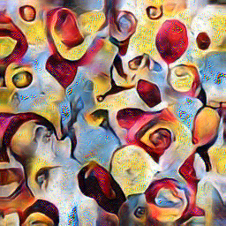
</figure>
<figcaption style="text-align: center; text-color: gray; font-size: 11px">Artifacts seen with 128 bin histograms</figcaption>

As an alternative, we added the histogram matching strategies used by Gatys et al. in [Controlling Perceptual Factors in Neural Style Transfer](https://arxiv.org/abs/1611.07865) (our implementation is based on [this implementation using NumPy](https://github.com/ProGamerGov/Neural-Tools)). These strategies match histograms by applying a linear transform on different decomposition bases of the covariances of each histogram (principal components, Cholesky decomposition, or symmetric eigenvalues). These strategies can be applied directly to the entire encoded feature tensors (rather than channel by channel) and so are significantly faster. The decompositions all work on the covariance of the tensors which have shapes dependent on the number of channels. This side-steps the need for binned histograms as the covariances will have the same shape regardless of the input image dimensions.

Each basis gives slightly different results, although in general they are comparable to the slower CDF-based approach.

<figure>

CDF

PCA

Chol

Sym

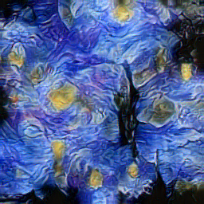 
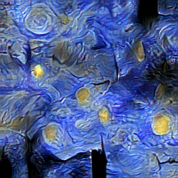
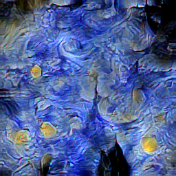
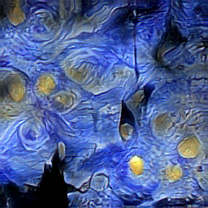

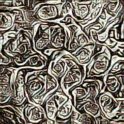 
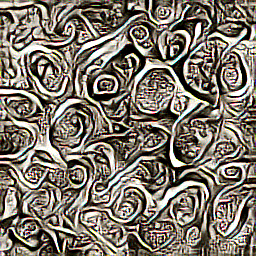
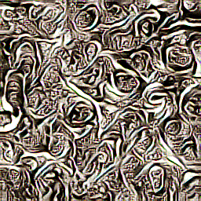
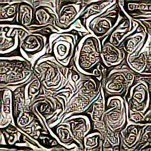

<figcaption style="text-align: center; text-color: gray; font-size: 11px">Comparison of texture synthesis with different histogram matching modes.</figcaption>
</figure>

### PCA
To speed up optimization, we decompose the feature tensors of both images to a set of principal components. These are chosen such that they capture 90% of the total variance in the style features at a given layer depth. These principal components lie along the axes which most contribute to a style's "character" and so it is sufficient to focus only on optimizing these most important directions. Despite reducing the dimensionality of the features significantly, the effect on quality is minimal as can be seen in the figure below.

 

<figure>

PCA

No PCA

 

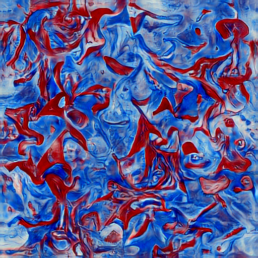 

</figure>

### Multi-scale synthesis
The next performance optimization is multi-scale synthesis. For this we opted to simply upscale the image between each pass of the optimization.  The general idea is that at smaller sizes, larger-scale shapes are transfered from the style, while at larger sizes, fine details are transfered.

We linearly space the sizes between 256 pixels and the specified output size. This ensures that details at all scales are captured. We also weight the number of iterations for each size to be greater for smaller (faster) images and less for larger (slower) images. This focuses the optimization on preserving larger-scale aspects of the style and helps improve speed.

Below we show the effect of multi-scale resolution on output quality. While the trend of preserving larger features is present in our implementation, it is less pronounced than the results of the original paper. We are unsure of the exact cause of this discrepancy, but suspect that the exact number of passes and iterations and sizes optimized at play an important role. These were not specified completely in the paper.

 
<figure style="text-align: center">
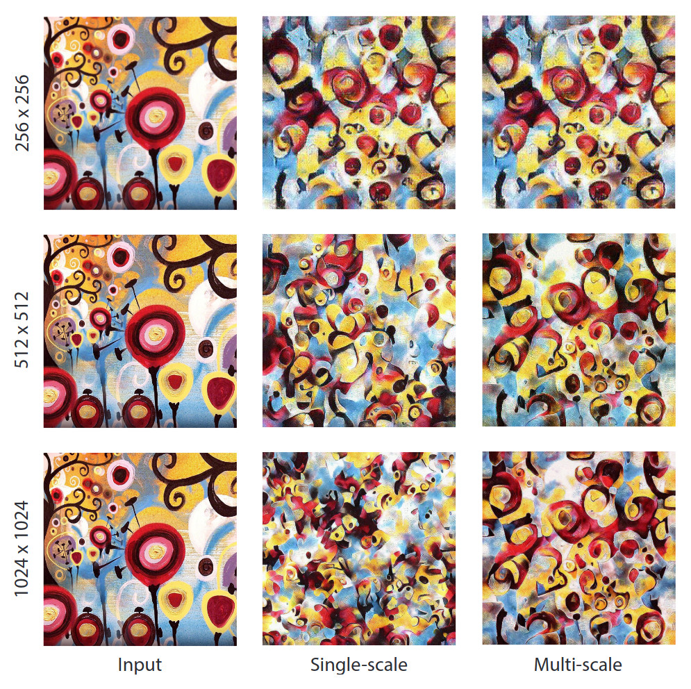
<figcaption style="text-align: center; text-color: gray; font-size: 11px">Figure 6 from the paper</figcaption>
</figure>

<figure>

Source

Single scale

Multi-scale

256 &nbsp &nbsp &nbsp &nbsp
 
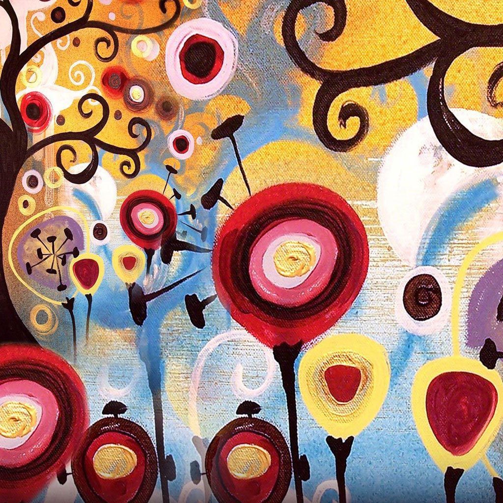 
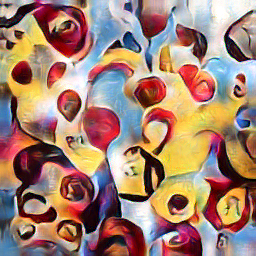
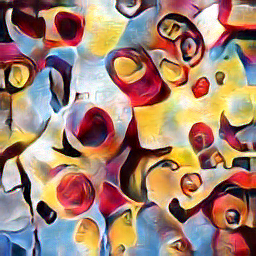

512 &nbsp &nbsp &nbsp &nbsp
 

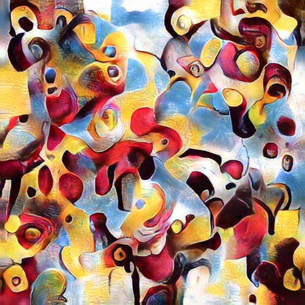
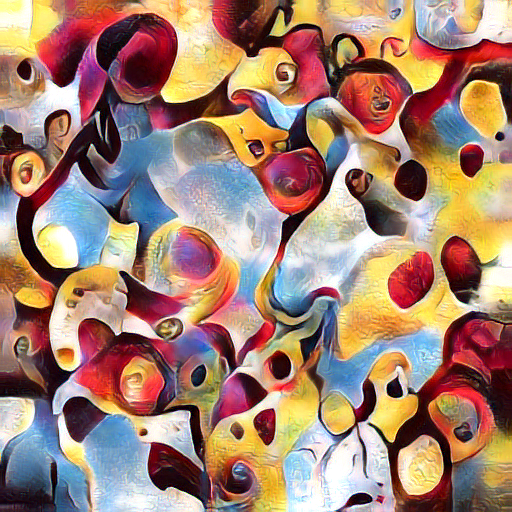

1024 &nbsp &nbsp &nbsp &nbsp
 
 
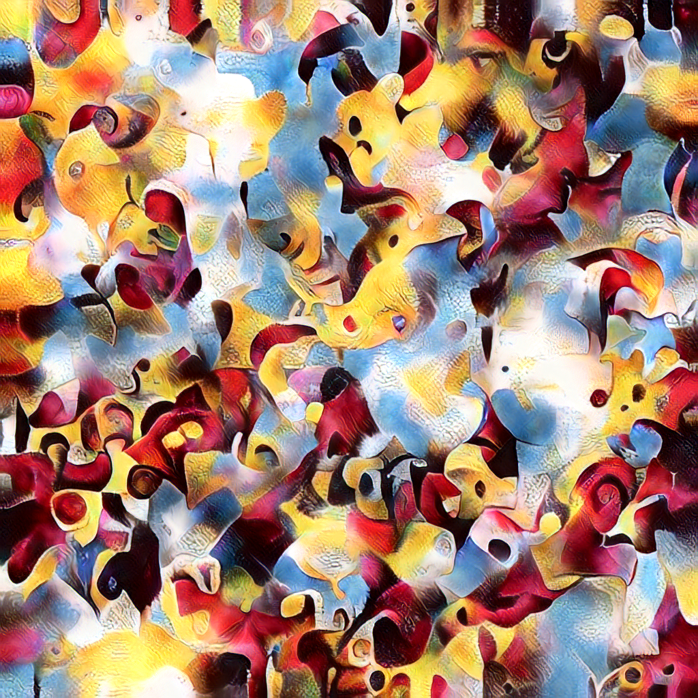
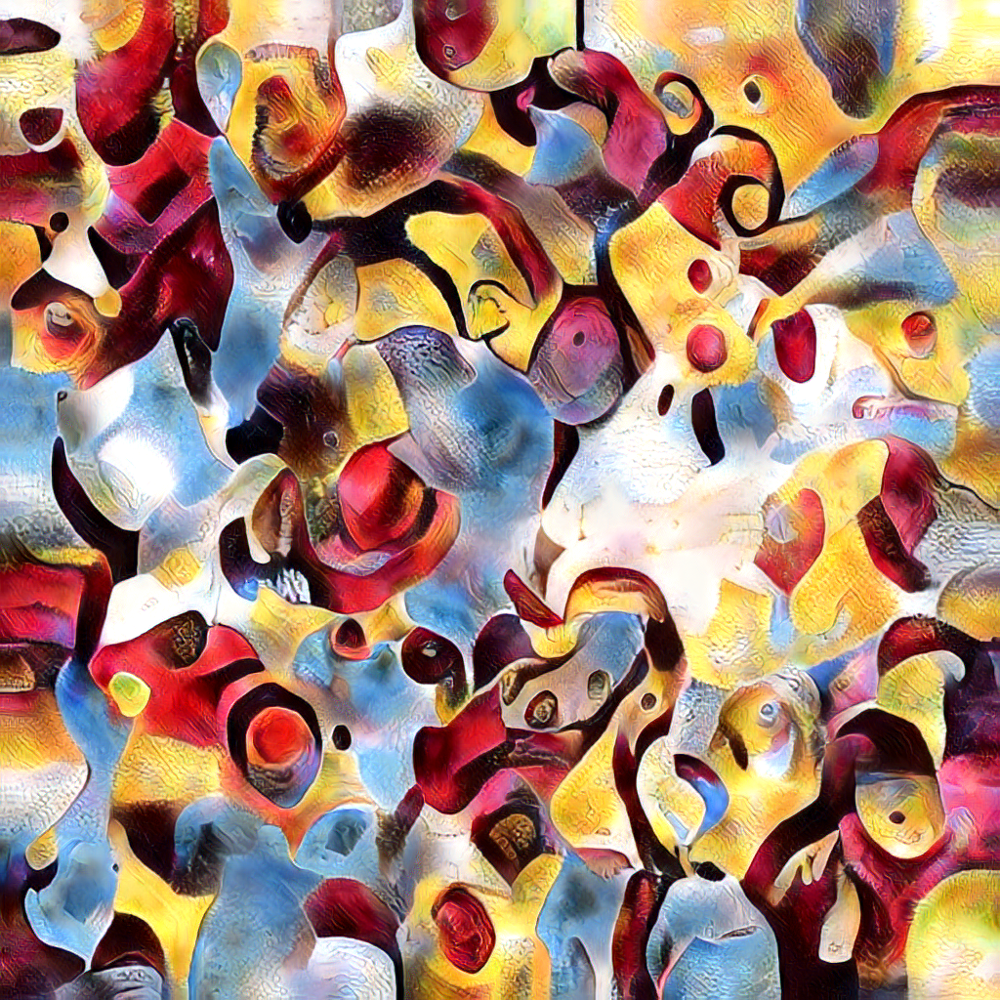

<figcaption style="text-align: center; text-color: gray; font-size: 11px">Texture synthesis with and without multi-scale rendering using CDF-based histogram matching</figcaption>
</figure>

### Style transfer
Style transfer is a simple extension of the texture synthesis task. The output image and style image are optimized in the exact same fashion. The content image is also encoded with the VGG network, then its mean is subtracted and that of the style images features added. This ensures that the features of the content and style aren't competing with each other in terms of any global bias in their feature tensors. Finally, the content is also projected onto the style's principle component basis. 

Rather than matching the histograms of the content and output image, output feature tensor is directly blended with the content's features at the deepest 3 layers (relu3_1, relu4_1, and relu5_1) after each histogram matching step.

<figure>

Style

0

0.1

0.2

0.3

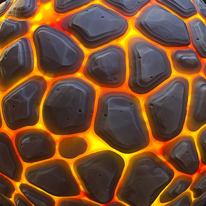 
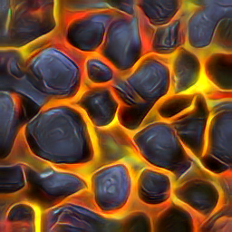

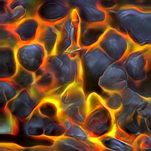
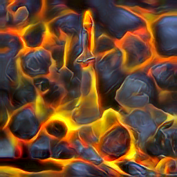

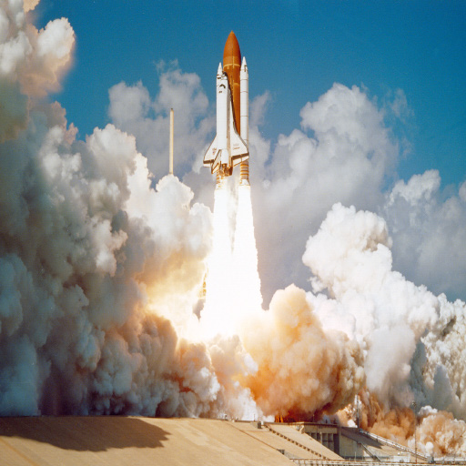 
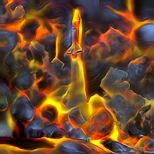
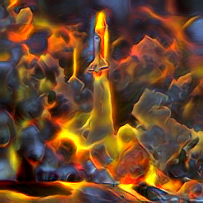
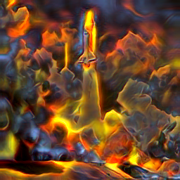
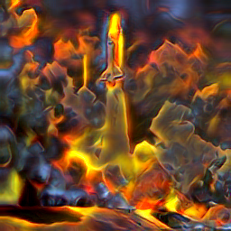

Content

0.5

0.7

0.9

1

<figcaption style="text-align: center; text-color: gray; font-size: 11px"></figcaption>
</figure>

### Color transfer
For the first step of this part it is required to apply normal style transfer to an input image (and a style image of course). The style transfer is applied on the input image which is represented by 3 channels, namely R(red), G(reen) and B(lue). For luminance style transfer the input image and output image are converted from RGB to H(ue)S(aturation)L(ightening). Then the H and S component from the imput image are combined with the L component of the output image. 
Our result is displayed the image below. As can be seen from this image, the effect of style transfer is diminished and more colors of the input image are maintained. Whereas, the effect of the style remains visible.

### Texture mixing

## Performance analysis
TODO performance of different parts of our algorithm at different sizes

==> where can most improvement be booked?

## Comparison with similar techniques
Performance comparison and quality comparison of comparable techniques

