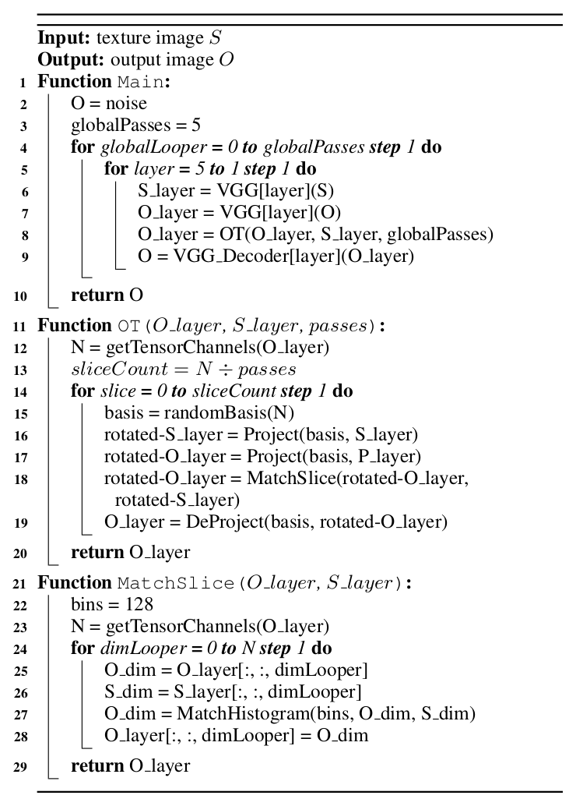

## Paper notes

### Overview
* Texture features represented by activations in bottleneck of auto-encoder
* Synthesize textures through optimal transport of one image's activations to that of another
    * N-dimensional PDF iteratively updated such that random rotations of PDF basis match the marginal distributions of target PDF along each dimension
    * Can also perform this in a reduced-dimensionality space for speed
    * Optimization happens directly in feature space which avoids backpropoagation training
* Multi-scale coarse-to-fine synthesis to preserve large scale structures
 
### Previous work
* Gatys et al.
    * Original neural style paper matches second order statistics of deep network's features (Gram matrices)
        * Most work follows this trend with different approximations of texture feature distribution
    * Adding histogram-based color matching and multi-scale optimization to this approach helps improve quality and speed
    * High cost to optimize (minutes per image at higher resolutions)
* Feed forward networks (Ulyanov et al, Johnson et al)
    * Train a network to learn to map images to styled images
    * Faster (can achieve real-time) but worse visual quality
    * Requires training a network per style
        * Although follow-up work addresses ways to make arbitrary styles work in this framework
* Chen & Schmidt et al.
    * introduce auto-encoder using pre-trained VGG network and trained an inversion network as decoder
    * Li et al. add extra decoders after each pooling layer + Whitening Color Transform (WCT)
    * Allows for arbitrary style transfer
* Ustyuzhaninov et al.
    * Nerual style can be applied even with random weights
    * Synthesis doesn't depend on the representation learned by VGG
    * LBFGS is the key

### Motivation
* Ustyuzhaninov shows that strong optimization approach gives good results whether the feature representation is strong or not (random features vs. Gatys VGG features)
* All the previous works share the use of second-order summary statistics and parametric synthesis
* First-order statistics
    * Many color-transfer methods focus on optimal transport of first-order statistics
        * Histogram color-matching helps performance of neural style
        * Patch-based Markov random fields
        * Inverse texxture synthesis (Wei et al.)
    * This approach might also work on non-linear-filter based neural features
 
 ### Algorithm
* Map into neural network feature space and perform optimization directly on the activations
    * Pre-trained VGG19 network used as encoder
        * features used: relu5_1, relu4_1, relu3_1, relu2_1, relu1_1
    * Train decoder to map features back to images
* Optimal transport
    * Sliced histogram matching approach (Pitie et al. 2007, Rabin et al. 2012)
        * Take random N-dimensional unit vector
        * Build orthogonal basis to the vector
        * Project PDFs onto that basis
        * Minimize the distance
    * Accuracy of features proportional to number of slices matched
    * Drawback: each layer's PDF is optimized in isolation and might introduce drift in others
    * Solution: repeatedly optimze layers one-by-one in multiple passes to converge to a better average
        * Empirically: 3-6 loops is OK with total number slices equal to number of channels of each layer
 
 
 
 ### PCA
* The fact that VGG's features become increasingly sparse implies the true representation of texture is lower-dimensional than VGG's features
* This motivates the use of PCA on the texture features of the smallest layer and projecting all other features to that basis
* Then optimization can be performed on the top N basis vectors which account for 90% of total variance

### Multi-resolution synthesis
* Perform optimization on image pyramid
* Divide by 2 until a dimension falls below 256 pixels
* Start with smallest image and intiialize next optimization with upscaled version

### Style Transfer
* Also match features of content image during optimization
* Weight coarser features stronger for content and finer features stronger for style
* ¿¿¿ "In addition, the content PDF is matched in a non-local way, where pixel coordinates targets specific locations in feature space." ???
    * Is this in reference to the next few bullets?
* Before content optimization: subtract content mean and add style mean
* After each MatchSlice(): O_layer = O_layer + (C_layer - O_layer) \* contentStrength
    * Only applied at Relu5_1, Relu4_1, and Relu3_1
    * 1/2 contentStrength at 4_1 and 1/4 at 3_1
* From end of paper, (undiscussed in style transfer section? or does it refer to contentStrength division?)
    * ¿¿¿ "For style transfer we add a progressively weighted content matching at relu3 1, relu4 1 and relu5 1 which increases the running time by a negligible amount." ???

### Color
* Gatys proposed histogram matching or luminance color transfer on output images
* With this approach, color can be controled directly as final 3D PDF on top of the auto-encoder
* Can combine both luminance and direct color transfer
    * convert content and output to HSL
    * use HS of content and L of output
    * then convert back to RGB
    * perform sliced histogram optimization of colors with the luminance-transfered image as content and original content as style

### Texture Mixing
* First determine optimal transport mappings from texture A to texture B and from B to A
* Create pixel mixing mask with random 0-1 interpolation values for each pixel
* in feature space, create mixed texture with (where i is interpolation value between 0 and 1):
    * mix = ceil(mixingMask - i)
    * S = (A \* (1 - i) + mapAB \* i) \* mix + (mapBA \* (1 - i) + B \* i) * (1 - mix)

### Masking
* Given masks that assign texture ID to each pixel in content and style images
* ¿¿¿ "First, the target PDF S must be re-balanced so that its feature histogram with respect to texture IDs matches the desired histogram for the content mask. This can be achieved by simply removing or duplicating samples from each histogram bin at random." ???
    * Re-balance target PDF to match desired histogram of content mask
    * Randomly duplicate samples in desired histogram for given pixel and randomly remove samples in the other histograms based on what the target is for that pixel
* Weight image regions in output so that they are more likely to map to regions of the style with the same texture ID
    * Before OT: make distribution mean of content histogram match mean of distribution in target histogram

### Speed
* Machine
    * 4-core Intel Core i5-6600k 3.5 GHz
    * 64 GB RAM
    * Nvidia Quadro P6000 24 GB
    * Ubuntu
* 1024x1024 image
    * 23 sec with PCA
    * 84 withut PCA
    * "This is in contrast to the back-propagation based optimization methods such as Risser et al. [2017] and Gatys et al. [2016b] that takes tens of minutes."
        * [My implementation](https://github.com/JCBrouwer/maua-style) of multi-scale, histogram matching neural style can achieve decent quality in ~135 seconds on system GTX 1080 Ti
